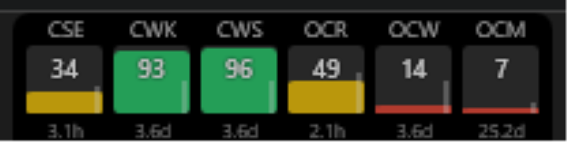
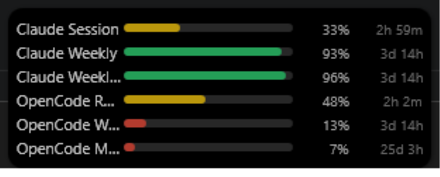

# AiMeter

A lightweight Windows desktop app that keeps your AI service usage limits visible at a
glance. AiMeter lives in the system tray and shows a small always-on-top widget that
tracks remaining quota and reset timers across AI providers.

It currently tracks **Claude** (claude.ai session/weekly limits) and **OpenCode**
(opencode.ai Go rolling/weekly/monthly usage), side by side, on an extensible provider
architecture designed for OpenAI, Gemini, Grok, OpenRouter, DeepSeek, and others.





## Download

**Latest release: v1.2.0** —
[AiMeter-v1.2.0-win-x64.zip](https://github.com/LanternOfDarkness/AiMeter/releases/download/v1.2.0/AiMeter-v1.2.0-win-x64.zip)

```
SHA-256: 0FD4A314931DA1F476E49D65F771C73B0E1CE5C8732F4981F7F4DE2FC4A6EC1D
```

Framework-dependent build for **win-x64** — needs the .NET 9 Desktop Runtime and the WebView2
Runtime (see [Requirements](#requirements)). Extract the zip and run `AiMeter.exe`.
Verify the download with `Get-FileHash AiMeter-v1.2.0-win-x64.zip -Algorithm SHA256`.

An Inno Setup installer (`installer/aimeter.iss`) is also available in this repo — see
[Installation](#installation) to build and run it locally. It isn't code-signed, so Windows
SmartScreen will warn on first run; a signed, hosted installer release is tracked as a
follow-up (see [docs/design.md](docs/design.md)).

See [CHANGELOG.md](CHANGELOG.md) for release notes.

## Features

- **Multiple providers** — track Claude and OpenCode together; log into each under
  Settings → Accounts. Deselect any metric you don't want on the widget.
- **Claude Extra Usage** — tracks Claude's pay-as-you-go spend limit as a dollar figure
  (`$used / $limit`) with a proportional bar. On an "Unlimited" Extra Usage plan (no monthly
  cap), it shows the prepaid balance left instead, with no bar.
- **Floating widget** — always-on-top, draggable, remembers its position (and can sit over
  the taskbar).
  - **Compact** layout: a slim strip of thin bars with % and a short reset label (`5h`, `2d 3h`).
    Fully customizable from Settings → Compact — bars-per-column (wraps into extra columns),
    bar width, cell/column gaps, font size, per-metric custom label and bar color, and a
    toggle to hide the always-visible numbers (they stay one hover away).
  - **Taskbar** layout: docks flush against the bottom of the screen, overlapping the
    taskbar — one thin vertical-fill column per metric showing a 3-letter code, the quota
    fill, the remaining % and a compact reset countdown (`3.3h`, `5.2d`) all at rest; hover a
    column for the full name and verbose reset time.
- **Log in required** — once the first poll completes, if no provider is logged in at all the
  widget shows a single "Log in required" call-to-action (instead of per-provider error
  tiles); click it to jump straight to Settings.
- **Widget controls** — hover the widget for Refresh / Settings / Switch Layout / Hide (they
  fade in at the top-right), or right-click anywhere on it for the same menu.
- **Reset countdowns** that stay live and format long windows as days + hours.
- **System tray** app: show/hide widget, open settings, refresh, exit.
- **Launch at startup** — optionally start AiMeter when you sign into Windows.
- **Stay over fullscreen** — keeps the widget above borderless-fullscreen games (toggle in
  Settings → General). True exclusive-fullscreen apps can't be overlaid by any window.
- **Game mode** — while a borderless-fullscreen game has focus on the widget's own monitor,
  the widget automatically becomes click-through: still visible and on top, but clicks pass
  straight through to the game. Reverts instantly when a normal window regains focus.
- **Adjustable opacity** with an on-hover dim, or turn opacity off entirely.
- **Configurable notifications** for low, exhausted, and reset quotas.
- **Pick which metrics are shown** — deselected metrics stay listed so you can re-enable them.

## Quota color states

| Remaining | Color |
|-----------|-------|
| 75–100%   | Green |
| 50–75%    | Blue |
| 25–50%    | Orange |
| 10–25%    | Red |
| 0–10%     | Dark red |
| Unknown   | Gray |

**Time bar** (Taskbar mode only): a thin sliver alongside each column's quota fill that fills
as the reset approaches — empty right after a reset, full just before the next one.

## Getting started

### Requirements
- Windows 10/11
- [.NET 9 SDK](https://dotnet.microsoft.com/download)
- [WebView2 Runtime](https://developer.microsoft.com/microsoft-edge/webview2/) — preinstalled
  on Windows 11 and current Windows 10; both providers log in and fetch through it.

### Build & run
```powershell
dotnet build src/AiMeter/AiMeter.csproj
dotnet run --project src/AiMeter/AiMeter.csproj
```

### Installation

To build the installer instead of running from source, publish a framework-dependent
build and compile it with [Inno Setup 6](https://jrsoftware.org/isinfo.php):
```powershell
dotnet publish src/AiMeter/AiMeter.csproj -c Release -r win-x64 --self-contained false -o publish/win-x64
iscc installer/aimeter.iss
```
This produces `installer/Output/AiMeter-setup-x64.exe`. Running it installs AiMeter to
`%LocalAppData%\Programs\AiMeter` — per-user, no admin/UAC prompt — with optional "Launch at
Windows startup" and desktop-shortcut checkboxes (both checked by default), and it checks
for and silently installs the .NET 9 Desktop Runtime and WebView2 Runtime prerequisites if
they're missing. Uninstalling removes the app but leaves `%AppData%\AiMeter` (your settings
and logs) untouched by default; you're asked once whether to remove those too.

On first run, open **Settings → Accounts** and log into Claude.ai and/or opencode.ai to
fetch your usage limits — each provider has its own login row. Authentication runs in an
embedded browser; only a lightweight "logged in" marker is stored locally (the real session
lives in the WebView2 profile). Log into just the providers you use.

## Configuration

Settings are stored as JSON at:
```
%AppData%\AiMeter\settings.json
```
This includes widget opacity, layout mode, saved position, selected metrics, polling
interval, and notification preferences. The embedded browser session lives alongside it in
`%AppData%\AiMeter\WebView2`.

Diagnostic logs are written daily to `%AppData%\AiMeter\logs\aimeter-{yyyy-MM-dd}.log` and
capture provider fetch failures, session expiry, and settings load/save errors — useful when
metrics stop updating with no visible explanation.

## Architecture

- **.NET 9 · WPF · MVVM** with `CommunityToolkit.Mvvm` and `Microsoft.Extensions.Hosting` DI.
- `IProvider` implementations fetch usage; `ProviderManager` polls, caches last-good data,
  filters by selection, and raises quota alerts.
- The widget and settings share a single live `AppConfig` singleton, persisted by
  `SettingsManager`.

See [docs/design.md](docs/design.md) for the full design document.

## License

See repository for license details.
