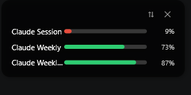
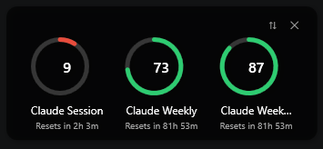
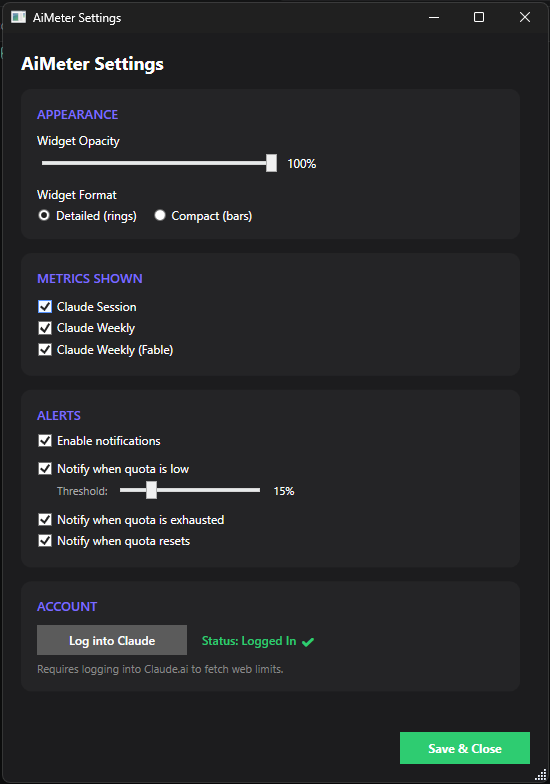

# AiMeter

A lightweight Windows desktop app that keeps your AI service usage limits visible at a
glance. AiMeter lives in the system tray and shows a small always-on-top widget that
tracks remaining quota and reset timers across AI providers.

The first release focuses on **Claude**, with an extensible provider architecture designed
for OpenAI, Gemini, Grok, OpenRouter, DeepSeek, and others.





## Features

- **Floating widget** — always-on-top, draggable, remembers its position.
  - **Detailed** layout: circular rings per metric with remaining %, name, and reset time.
  - **Compact** layout: a slim strip of thin bars with % and a short reset label (`5h`, `2d 3h`).
- **Right-click menu** on the widget: Refresh Now, Switch Layout, Settings, Hide.
- **Reset countdowns** that stay live and format long windows as days + hours.
- **System tray** app: show/hide widget, open settings, refresh, exit.
- **Adjustable opacity** with an on-hover dim, or turn opacity off entirely.
- **Configurable notifications** for low, exhausted, and reset quotas.
- **Pick which metrics are shown** — deselected metrics stay listed so you can re-enable them.

## Quota color states

| Remaining | Color |
|-----------|-------|
| 75–100%   | Green |
| 50–75%    | Blue |
| 25–50%    | Orange |
| 10–25%    | Red |
| 0–10%     | Dark red |
| Unknown   | Gray |

## Getting started

### Requirements
- Windows 10/11
- [.NET 9 SDK](https://dotnet.microsoft.com/download)

### Build & run
```powershell
dotnet build src/AiMeter/AiMeter.csproj
dotnet run --project src/AiMeter/AiMeter.csproj
```

On first run, open **Settings → Accounts** and log into Claude.ai to fetch your web usage
limits. Authentication runs in an embedded browser; only a lightweight "logged in" marker
is stored locally.

## Configuration

Settings are stored as JSON at:
```
%AppData%\AiMeter\settings.json
```
This includes widget opacity, layout mode, saved position, selected metrics, polling
interval, and notification preferences. The embedded browser session lives alongside it in
`%AppData%\AiMeter\WebView2`.

Diagnostic logs are written daily to `%AppData%\AiMeter\logs\aimeter-{yyyy-MM-dd}.log` and
capture provider fetch failures, session expiry, and settings load/save errors — useful when
metrics stop updating with no visible explanation.

## Architecture

- **.NET 9 · WPF · MVVM** with `CommunityToolkit.Mvvm` and `Microsoft.Extensions.Hosting` DI.
- `IProvider` implementations fetch usage; `ProviderManager` polls, caches last-good data,
  filters by selection, and raises quota alerts.
- The widget and settings share a single live `AppConfig` singleton, persisted by
  `SettingsManager`.

See [docs/design.md](docs/design.md) for the full design document.

## License

See repository for license details.
